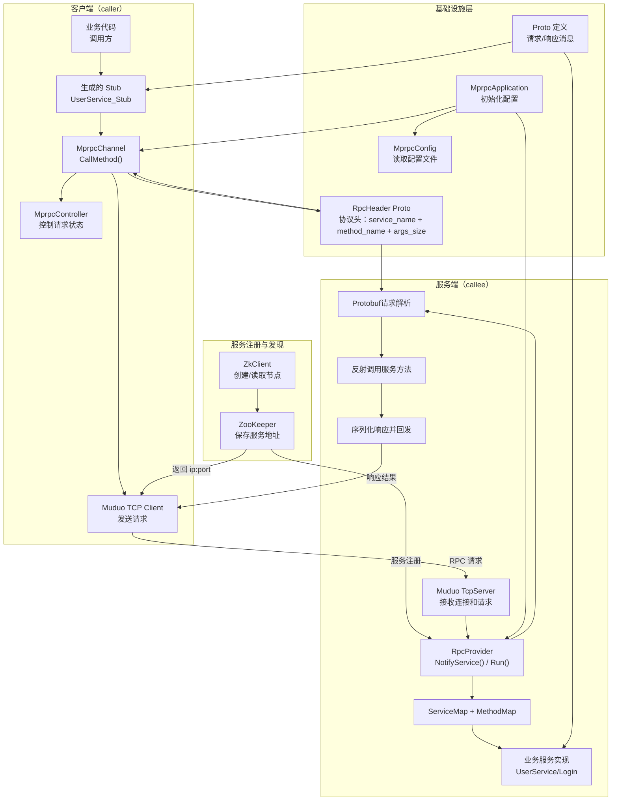
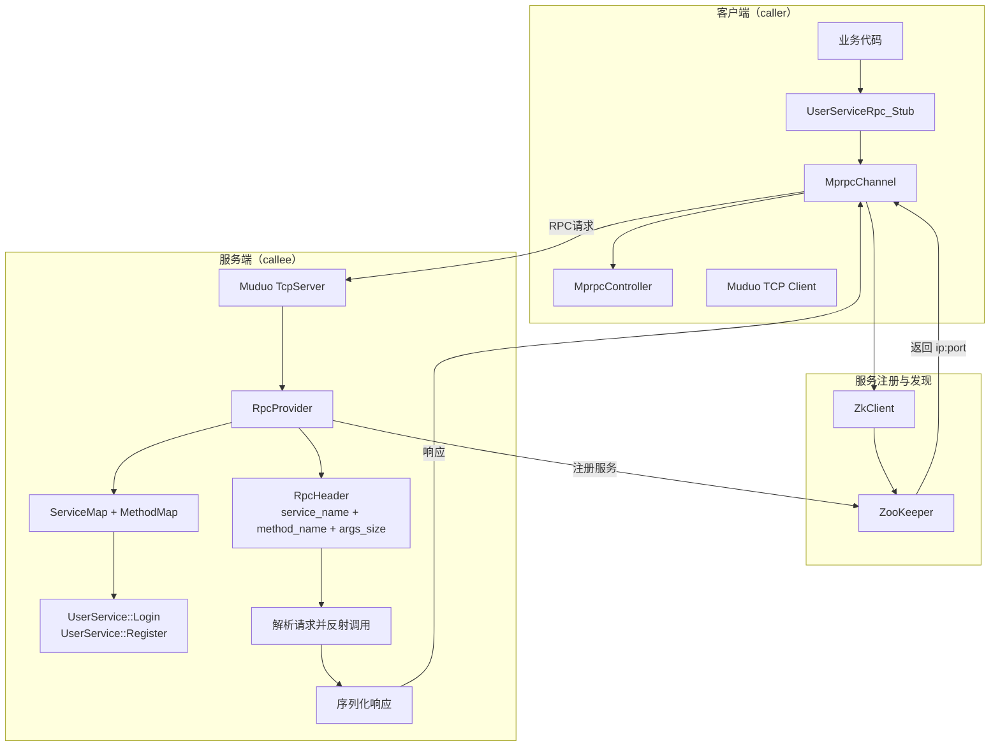

安装zookeeper protobuf
需要开启zookeeper               zkServer.sh start          

# mprpc 项目框架图

> 如果你在 VS Code 里直接打开的是源代码文件，看到的是文本代码块；要看带箭头的图，请用“Markdown: Open Preview”或右键打开预览。

## 流程说明

1. 客户端业务代码调用生成的 Stub。
2. MprpcChannel 负责打包 Protobuf 请求和 RPC Header。
3. ZkClient 查询 ZooKeeper，拿到目标服务的 ip 和 port。
4. 客户端连接服务端并发送请求。
5. RpcProvider 在服务端解析请求，定位 service 和 method。
6. 调用具体业务实现，例如 Login / Register。
7. 业务执行完成后，将响应回传给客户端。

这就是整个 mprpc 框架的核心调用链。

## 关键流程

1. 服务端启动时，RpcProvider::Run() 会读取配置，并在 ZooKeeper 中注册服务节点。
2. 客户端调用 Stub 方法时，MprpcChannel::CallMethod() 会先访问 ZooKeeper，拿到目标服务地址。
3. 客户端根据地址建立 TCP 连接，并把请求头和请求参数一起发送出去。
4. 服务端收到请求后，解析 RpcHeader，找到对应的 service 和 method，调用业务实现。
5. 业务函数执行完成后，返回响应并由框架序列化回传给客户端。

> 这个框架的核心是：Protobuf + Muduo + ZooKeeper + 自定义 RpcHeader。